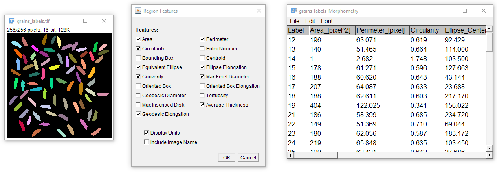

## RegionFeaturesJ

RegionFeaturesJ is an ImageJ library for computing features for regions stored in a label map.
The library currently contains three plugins, for computing different kind of features:

* 2D morphological features (area, perimeter, equivalent ellipses, Feret Diameter...)
* 3D morphological features (volume, surface area, equivalent ellipsoid...)
* intensity features (mean, median, min, max, standard deviation...)



Different options are provided, to include the name of the original image within the table, 
or to include measurement units within names of table columns.

The library also makes it possible to manage features directly via the "RegionFeatures" class. 
Features can be added programmatically, and the resulting values are be concatenated into the
ResultsTable in the order specified by addition order.
It is also possible to add its own feature(s), and include them into the resulting table.

### Installation

Simply put the `RegionFeaturesJ.jar` into the plugins directory of the current ImageJ/Fiji installation.

### GUI Use

Once ImageJ is restarted, the different plugins are available in the following menus:

* Plugins -> IJ Tools -> RegionFeaturesJ -> Region Morphology
* Plugins -> IJ Tools -> RegionFeaturesJ -> Region Morphology (3D)
* Plugins -> IJ Tools -> RegionFeaturesJ -> Region Intensity Features

The behavior of the dialogs are similar to that of the "Analyze Regions (2D/3D)" Plugins in MorphoLibJ. 
Results are displayed in a ResultsTable.

### Programmatic use

A RegionFeatures object may be initialized with an image containing a **label map**, i.e. an image (8-bits, 16-bits, or 32-bits) 
containing for each pixel the integer label of the region it belongs to.
```java
// setup an ImagePlus containing the label map
ImagePlus image = createImagePlus();
RegionFeatures features = RegionFeatures.initialize(image);
```

The features to computes are specified by adding the feature classes to the RegionFeatures object.
```java
features.add(Area.class)
        .add(Perimeter.class)
        .add(Circularity.class)
        .add(Centroid.class);
```

The results of computation can be displayed into a results table:
```java
ResultsTable table = features.createTable();
table.show("Features");
```

Note that it is also possible to concatenate the whole worflow:
```java
ResultsTable table = RegionFeatures.initialize(image)
        .add(Area.class)
        .add(Perimeter.class)
        .add(Circularity.class)
        // potentially other features
        .createTable();
```

The computation result of a specific feature can be obtained by inspecting the "results" field. 
It may be necessary to ensure that the feature is computed by using the `computeAll()` method.
For example the centroid can be retrieved as follow:
```java
features.computeAll();
Point2D[] obj = (Point2D[]) features.results.get(Centroid.class);
```

### Adding its own feature

It is possible to include its own user-defined feature(s) into the resulting Table, without having to modify the plugin.
Each user-defined feature must implement the `Feature` interface, and implement two methods:

* The `compute(...)` method is used to retrieve data that were already computef from the regions. It returns an object whose class is specific to the feature.
* the `updateTable(...)` method populates the `ResultsTable` with the feature data computed on the image. It may contain only a subset of the information computed during the process.

It is possible to rely on other features for computing new features. For example, the "Circularity" feature is computed based on the "Area" and "Perimeter" features.
When implementing a feature, it is possible to declare which features it depends on, by overriding the `requiredFeatures()` method. 
Then, when the feature is computed, 
it can first control that required features are computed, and compute them if necessary. 
Note that the results Table is populated only with features that are specified by using the `add(featureClass)` method.

### Planned extension

* Display the results on a specifed ImagePlus (as an overlay, for example)
* add topological features (number of neighbor regions, distance to closest neighbor...)
* add graphical user interface to manage user-defined features
